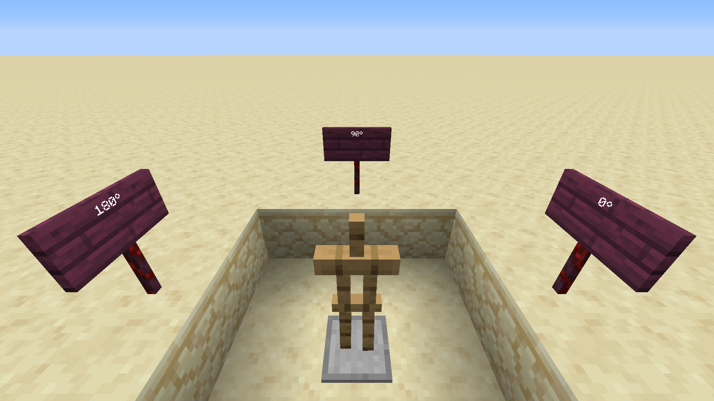

## General Syntax
In Sandstone, NBTs are regular JavaScript objects. JavaScript objects are very close to NBTs: they have arrays, objects, keys and values, numbers and strings.

For example, to summon an invisible armor stand with the "hello" tag and a pumpkin on his head, you would do the following command:
```ts
summon('minecraft:armor_stand', rel(0, 0, 0), { 
    Invisible: 1, 
    Tags: ["hello"], 
    ArmorItems: [
      {}, {}, {}, { id: "minecraft:carved_pumpkin", Count: 1 },
    ]
})
```

## Units

### Usefulness
Despite JavaScript objects and NBTs being close, there is one thing missing from JavaScript objects that is required in NBTs: specifying units.

For example, to summon an armor stand with a given rotation, you need to specify that the values are floats.

With this command, you get the expected result:
```
/summon minecraft:armor_stand ~ ~ ~ {Rotation: [90.0f, 0.0f]}
```



Omit the unit, and the armor stand rotation will be wrong:
```
/summon minecraft:armor_stand ~ ~ ~ {Rotation: [90.0, 0.0]}
```


Here, specifying that the values are floats is mandatory. However, this isn't possible to do it with a normal JavaScript object.

### Syntax

To specify a unit, you must call the corresponding method under the `NBT` object. For all units, there is 2 possible calls:
- With a single number. It will add the given unit to the number.
- With an array of numbers. It will add the given unit to all numbers in the array.

For example, to summon an armor stand with `Invisible: 1b` and `Rotation: [90f, 0f]`, you must write:
```ts
import { NBT } from 'sandstone/variables'

summon('minecraft:armor_stand', rel(0, 0, 0), {
  Invisible: NBT.byte(1),       // => Invisible: 1b
  Rotation: NBT.float([90, 0]), // => Rotation: [90f, 0f]
})
```

### All units

Here is a summary of all units and their corresponding methods.

type   |  unit   | method
-------|---------|-------------
float  |  `'f'`  | `NBT.float` 
double |  `'d'`  | `NBT.double`
byte   |  `'b'`  | `NBT.byte`
short  |  `'s'`  | `NBT.short`
long   |  `'l'`  | `NBT.long`